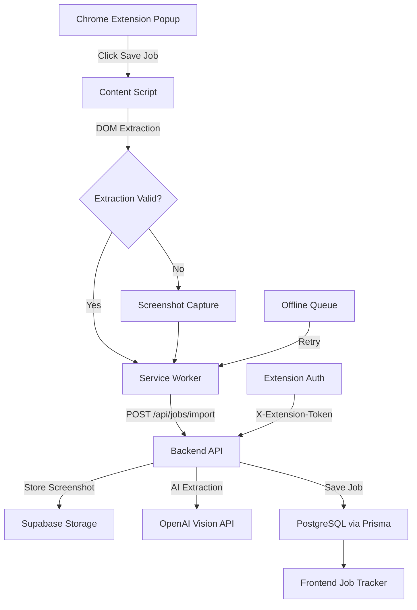

# Chrome Extension Job Capture & Intelligent Extraction

## Background & Context

The existing **DevOS** application is a full-stack monorepo (React+Vite frontend, Express+Prisma backend, PostgreSQL on Neon). It already has a fully functional **Job Tracker** module at `/jobs` with a `Job` Prisma model, CRUD API, Supabase storage, OpenAI integration, JWT-based auth via httpOnly cookies, and session management (Redis + Postgres).

This plan adds a Chrome Extension companion that captures job postings from any website and saves them into the existing Job Tracker via a multi-level extraction pipeline.

---

## User Review Required

> [!IMPORTANT]
> **Authentication Strategy**: The existing app uses httpOnly cookies (`sameSite: 'lax'` in dev, `'none'` in prod). Chrome extensions cannot access httpOnly cookies. The plan creates a **token-based extension auth** flow: user logs into the webapp, clicks "Connect Extension" in Settings, which generates a one-time token; the extension exchanges this for a long-lived API token stored in `chrome.storage.local`. This is consistent with how the project already handles Telegram linking (generate PIN → exchange). **Does this approach work for you?**

> [!IMPORTANT]
> **AI Provider for Vision Extraction**: We will use Gemini (via Google's Gemini API) for screenshot-based job extraction, since it is free. We will configure the backend to use a `GEMINI_API_KEY` for this purpose. **Please ensure you have a Gemini API key ready for the `.env` file.**

> [!IMPORTANT]  
> **Scope of Job Model Changes**: The existing `Job` model has fields like `company`, `role`, `location`, `salary`, `jobUrl`, `status`, `notes`. The plan **adds new fields** to this existing model (`description`, `employmentType`, `experienceMin`, `experienceMax`, `salaryMin`, `salaryMax`, `skills`, `education`, `source`, `sourceUrl`, `screenshotUrl`, `extractionStatus`, `extractionMethod`, `extractionError`, `extractionConfidence`, `capturedAt`) via a Prisma migration. Existing jobs will get defaults (`extractionStatus = 'manually_completed'`). **No existing data is lost.** Does this approach work?

## Open Questions

> [!NOTE]
> **Salary field**: The existing model stores salary as a single `String?`. The spec asks for `salary_min` / `salary_max` as numeric fields. The plan adds `salaryMin` / `salaryMax` as `Int?` while keeping the existing `salary` string field for display. Should we deprecate the old `salary` field eventually?

---

## Proposed Changes

The implementation is broken into **10 phases** as specified. Here's the full file-by-file plan:

---

### Phase 1 — Chrome Extension Scaffold

#### [NEW] `job-capture-extension/manifest.json`
Manifest V3 Chrome Extension with permissions: `tabs`, `activeTab`, `scripting`, `storage`. Host permissions scoped to `<all_urls>` (needed to run content scripts on any job site). Popup UI, content script, service worker.

#### [NEW] `job-capture-extension/package.json`
Build tooling — TypeScript compilation with `tsc`, no bundler initially (plain TS → JS). If we find bundling needed for React popup, we add Vite.

#### [NEW] `job-capture-extension/tsconfig.json`
TypeScript config targeting ES2020, DOM lib, strict mode.

#### [NEW] `job-capture-extension/src/popup/popup.html`
Popup HTML shell — loads popup.js and popup.css.

#### [NEW] `job-capture-extension/src/popup/popup.ts`
Popup logic — detects current page, shows extraction status, "Capture & Save Job" button. Communicates with content script and service worker via `chrome.runtime.sendMessage`.

#### [NEW] `job-capture-extension/src/popup/popup.css`
Clean, premium popup styling matching DevOS design language (dark theme, Inter font, indigo/violet accents).

#### [NEW] `job-capture-extension/src/background/service-worker.ts`
Service worker — handles message routing between popup, content script, and backend API. Manages auth token from `chrome.storage.local`. Handles screenshot capture via `chrome.tabs.captureVisibleTab()`. Orchestrates the multi-level extraction flow.

#### [NEW] `job-capture-extension/src/content/content.ts`
Content script entry — injected into job pages. Listens for messages from service worker to trigger DOM extraction.

#### [NEW] `job-capture-extension/src/types/job.ts`
Shared TypeScript types for extracted job data, messages, and API responses.

---

### Phase 2 — DOM Extraction Engine

#### [NEW] `job-capture-extension/src/content/extractor.ts`
Main extraction orchestrator — runs extractors in priority order: JSON-LD → Meta tags → Site-specific → Generic → validates results.

#### [NEW] `job-capture-extension/src/content/dom-parser.ts`
Utility functions for DOM parsing — safe querySelector, text extraction, attribute reading.

#### [NEW] `job-capture-extension/src/content/site-detectors/index.ts`
Detector registry — maps hostname patterns to site-specific extractors.

#### [NEW] `job-capture-extension/src/content/site-detectors/generic.ts`
Generic fallback extractor — JSON-LD `JobPosting` schema, OpenGraph meta, semantic HTML (`<h1>`, `<article>`, `<main>`), common class names (`.job-title`, `.company-name`), ARIA labels.

#### [NEW] `job-capture-extension/src/content/site-detectors/linkedin.ts`
LinkedIn-specific selectors for job title, company, location, description, skills.

#### [NEW] `job-capture-extension/src/content/site-detectors/indeed.ts`
Indeed-specific selectors.

#### [NEW] `job-capture-extension/src/content/site-detectors/naukri.ts`
Naukri-specific selectors.

#### [NEW] `job-capture-extension/src/content/validators.ts`
Extraction validation — checks required fields (`job_title`, `company`, `location OR description`, `source_url`), calculates confidence score (0.0–1.0). Threshold: 0.6 for DOM success.

---

### Phase 3 — Backend API & Database Extension

#### [MODIFY] [schema.prisma](file:///Users/tanishjain/carrer/mainprojects/personalplace/backend/prisma/schema.prisma)
Add new fields to existing `Job` model:
```diff
model Job {
   // ... existing fields ...
+  description      String?
+  employmentType   String?
+  experienceMin    Int?
+  experienceMax    Int?
+  salaryMin        Int?
+  salaryMax        Int?
+  skills           String[]
+  education        String[]
+  source           String?        // "linkedin", "indeed", "naukri", "other"
+  sourceUrl        String?        // canonical job URL
+  screenshotUrl    String?
+  extractionStatus ExtractionStatus @default(MANUAL)
+  extractionMethod String?        // "dom", "screenshot_ai", null
+  extractionError  String?
+  extractionConfidence Float?
+  capturedAt       DateTime?
}

+enum ExtractionStatus {
+  MANUAL            // jobs created manually (existing behavior, default)
+  PENDING
+  DOM_EXTRACTED
+  AI_EXTRACTED
+  NEEDS_REVIEW
+  MANUALLY_COMPLETED
+}
```

Add new model for extension API tokens:
```diff
+model ExtensionToken {
+  id        String   @id @default(cuid())
+  userId    String
+  token     String   @unique
+  name      String   @default("Chrome Extension")
+  lastUsed  DateTime?
+  expiresAt DateTime
+  createdAt DateTime @default(now())
+  user      User     @relation(fields: [userId], references: [id], onDelete: Cascade)
+  @@index([userId])
+}
```

Add `extensionTokens ExtensionToken[]` to the `User` model.

#### [NEW] `backend/src/modules/jobs/job-import.controller.ts`
New controller for `POST /api/jobs/import` — handles multipart form data (screenshot + JSON job data). Validates, deduplicates, stores screenshot, creates job record.

#### [NEW] `backend/src/modules/jobs/job-import.service.ts`
Import service — deduplication logic (by `sourceUrl` first, then `company` + `role` + `location` combo), screenshot storage via existing `uploadFile`, AI extraction via new vision service.

#### [NEW] `backend/src/services/vision-ai.service.ts`
Vision AI extraction service with abstract provider interface:
```typescript
interface VisionAIProvider {
  extractJobFromImage(imageBuffer: Buffer, partialData?: Partial<JobData>): Promise<JobExtractionResult>;
}

class GeminiVisionProvider implements VisionAIProvider { ... }
```
Uses Gemini 1.5 Flash with vision. Sends screenshot + any partial DOM data. Returns structured JSON. Never invents information (null for missing fields).

#### [MODIFY] [jobs.routes.ts](file:///Users/tanishjain/carrer/mainprojects/personalplace/backend/src/modules/jobs/jobs.routes.ts)
Add new import route:
```diff
+import * as importController from './job-import.controller';
+
+// Extension import endpoint
+router.post('/import', upload.single('screenshot'), importController.importJob);
```

#### [MODIFY] [env.ts](file:///Users/tanishjain/carrer/mainprojects/personalplace/backend/src/config/env.ts)
Add `GEMINI_API_KEY` config.

---

### Phase 4 — Extension Authentication

#### [NEW] `backend/src/modules/auth/extension-auth.controller.ts`
Two endpoints:
1. `POST /api/auth/extension-token` (requires `authenticate` middleware) — generates a token for extension use, stores it in `ExtensionToken` table.
2. `POST /api/auth/extension-verify` — takes an extension token, returns user info (used by extension to verify connection).

#### [MODIFY] [auth.routes.ts](file:///Users/tanishjain/carrer/mainprojects/personalplace/backend/src/modules/auth/auth.routes.ts)
Mount new extension auth routes.

#### [NEW] `backend/src/middleware/extension-auth.middleware.ts`
Middleware that authenticates requests via `X-Extension-Token` header. Looks up `ExtensionToken` in DB, validates expiry, sets `req.user`.

#### [MODIFY] [jobs.routes.ts](file:///Users/tanishjain/carrer/mainprojects/personalplace/backend/src/modules/jobs/jobs.routes.ts)
The `/import` endpoint accepts both cookie auth AND extension token auth.

#### [NEW] `job-capture-extension/src/services/api.ts`
Extension API client — stores/retrieves token from `chrome.storage.local`, sends requests to backend with `X-Extension-Token` header.

#### [NEW] `job-capture-extension/src/services/auth.ts`
Auth flow for extension — connect/disconnect, token exchange, connection status check.

---

### Phase 5 — Screenshot Capture

#### [NEW] `job-capture-extension/src/services/screenshot.ts`
Screenshot service using `chrome.tabs.captureVisibleTab()` from the service worker. Captures the visible area as PNG. Converts to base64 for upload.

#### [MODIFY] `job-capture-extension/src/background/service-worker.ts`
Integrate screenshot capture into the extraction flow: DOM fails → capture screenshot → send to backend.

---

### Phase 6 — AI/OCR Extraction (Backend)

Already covered by the `vision-ai.service.ts` in Phase 3. The import endpoint flow:

```
1. Receive screenshot + partial DOM data
2. Upload screenshot to Supabase/local storage
3. Send screenshot to OpenAI Vision API with prompt
4. Parse structured JSON response
5. Merge AI results with DOM partial data
6. Validate merged results
7. Set extraction_status accordingly
```

---

### Phase 7 — Guaranteed Fallback

Built into the import flow in `job-import.service.ts`:

```typescript
async importJob(userId, data) {
  // 1. Check duplicate
  // 2. Store screenshot (if provided)
  // 3. Determine extraction status from data quality
  //    - Has required fields from DOM → "dom_extracted"
  //    - Has required fields from AI → "ai_extracted"  
  //    - Missing required fields → "needs_review"
  // 4. ALWAYS create job record, never discard
}
```

---

### Phase 8 — Manual Review UI (Frontend)

#### [MODIFY] [types/index.ts](file:///Users/tanishjain/carrer/mainprojects/personalplace/frontend/src/types/index.ts)
Update `Job` interface with new fields (`description`, `skills`, `source`, `sourceUrl`, `screenshotUrl`, `extractionStatus`, `extractionMethod`, `extractionConfidence`, `capturedAt`).

#### [MODIFY] [JobsPage.tsx](file:///Users/tanishjain/carrer/mainprojects/personalplace/frontend/src/pages/JobsPage.tsx)
- Add extraction status badge to job cards (DOM Extracted ✓, AI Extracted ✓, Needs Review ⚠️)
- Add "Needs Review" filter to the job list
- Add screenshot preview in job detail view
- Add "Review & Complete" button for `needs_review` jobs that opens the review modal

#### [NEW] `frontend/src/components/job-review-modal.tsx`
Split-pane review modal:
- Left: Screenshot image (zoomable)
- Right: Editable form (title, company, location, description, skills, experience, salary, employment type)
- Save button marks job as `manually_completed`

#### [MODIFY] [SettingsPage.tsx](file:///Users/tanishjain/carrer/mainprojects/personalplace/frontend/src/pages/SettingsPage.tsx)
Add "Chrome Extension" section:
- "Connect Extension" button — generates extension token
- Shows connection status
- "Disconnect" button to revoke token

---

### Phase 9 — Duplicate Detection & Local Retry

#### Duplicate Detection (Backend)
Built into `job-import.service.ts` — checks `sourceUrl` exact match first, then fuzzy match on `company` + `role` + `location`.

#### [NEW] `job-capture-extension/src/services/offline-queue.ts`
Local queue using `chrome.storage.local`:
- When backend is unavailable, store capture in local queue
- Background retry with exponential backoff via `chrome.alarms`
- Badge indicator showing pending syncs
- Sync queue when connection restored

---

### Phase 10 — Polish & Testing

- Test across LinkedIn, Indeed, Naukri, and generic job sites
- Verify all 7 test scenarios from the spec
- Error handling for all edge cases
- Extension popup micro-animations and loading states

---

## Architecture Summary



---

## File Summary

| Phase | New Files | Modified Files |
|-------|-----------|----------------|
| 1 | 8 (extension scaffold) | 0 |
| 2 | 7 (extractors + validators) | 0 |
| 3 | 3 (import controller/service, vision AI) | 3 (schema, routes, env) |
| 4 | 4 (auth controller, middleware, extension services) | 2 (auth routes, job routes) |
| 5 | 1 (screenshot service) | 1 (service worker) |
| 6 | 0 (covered in Phase 3) | 0 |
| 7 | 0 (covered in Phase 3) | 0 |
| 8 | 1 (review modal component) | 3 (types, JobsPage, SettingsPage) |
| 9 | 1 (offline queue) | 0 |
| 10 | 0 | 0 (testing) |
| **Total** | **~25 new files** | **~9 modified files** |

---

## Verification Plan

### Automated Tests
```bash
# 1. Prisma migration
cd backend && npx prisma migrate dev --name add-job-capture-fields

# 2. Backend compilation
cd backend && npx tsc --noEmit

# 3. Frontend compilation  
cd frontend && npx tsc --noEmit

# 4. Extension build
cd job-capture-extension && npx tsc --noEmit
```

### Manual Verification
1. Load extension in `chrome://extensions` (developer mode)
2. Navigate to a LinkedIn job posting → click extension → verify DOM extraction
3. Navigate to an unknown job site → verify generic extraction + screenshot fallback
4. Disconnect backend → verify local queue storage
5. Verify "Needs Review" jobs appear in web app with screenshot
6. Complete a review → verify status changes to `manually_completed`
7. Capture same job twice → verify duplicate detection
